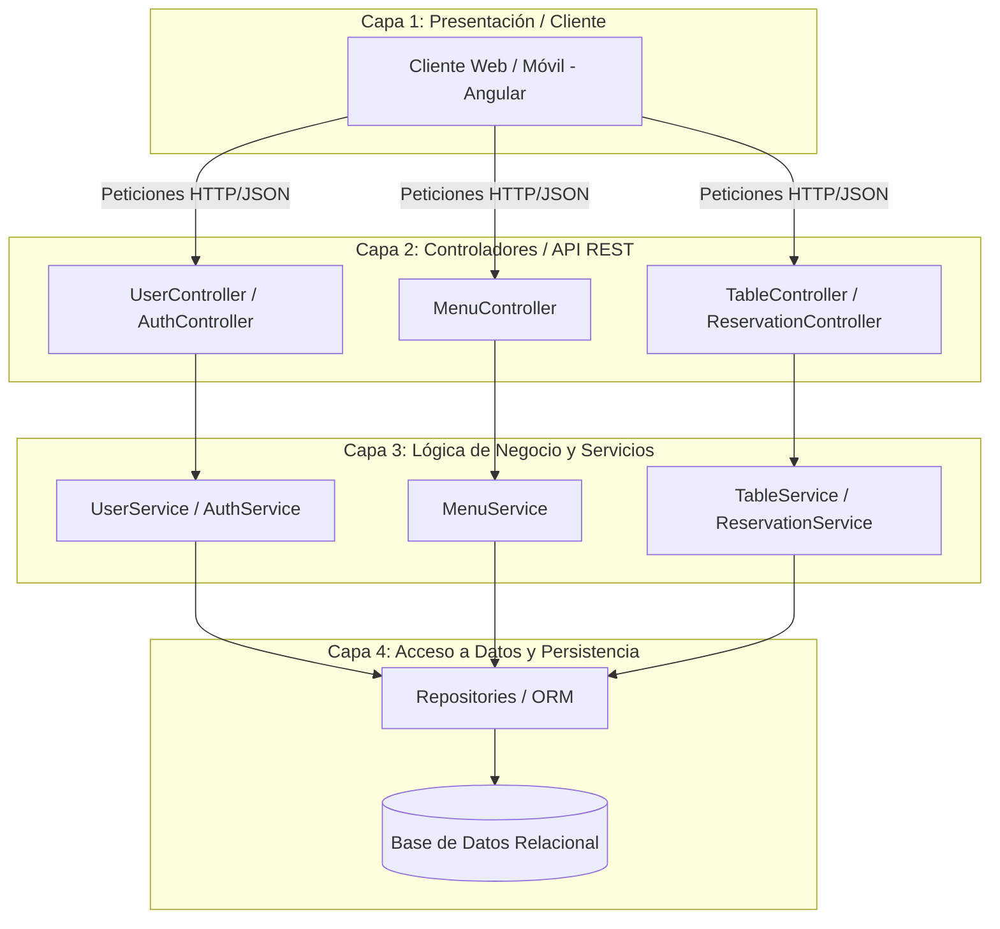
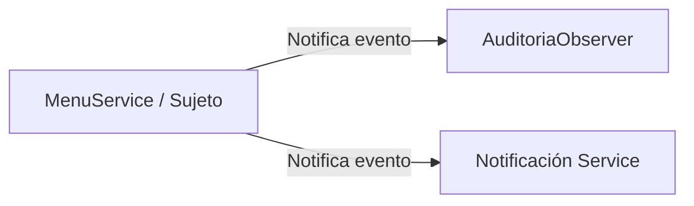

# Diseño del Sistema SIAR (Sistema Integral de Administración para Restaurantes)

---

## 1. Arquitectura del Sistema

El sistema **SIAR** utiliza una **Arquitectura en Capas (Layered Architecture / N-Tier Architecture)** basada en el estándar **MVC (Modelo-Vista-Controlador)** desacoplado, combinada con un esquema cliente-servidor API REST.



### Descripción de Capas:
1. **Capa de Presentación (Frontend):** Desarrollada con un framework cliente (ej. Angular), encargada de la interfaz gráfica e interacción con el usuario (administradores, cajeros, clientes y meseros).
2. **Capa de Controladores / Endpoints (API REST):** Recibe las solicitudes HTTP/HTTPS desde el cliente, valida los DTOs (Data Transfer Objects) de entrada y expone respuestas estructuradas en JSON.
3. **Capa de Negocio / Servicios (Backend Services):** Contiene la lógica del negocio, validaciones de reglas del restaurante (por ejemplo, disponibilidad de mesas, control de roles, cambio de precios) y coordinación de operaciones.
4. **Capa de Persistencia / Acceso a Datos:** Gestiona la comunicación con la base de datos relacional mediante un ORM/Mapeador, garantizando la integridad de datos y las transacciones.

---

## 2. Patrones de Diseño Seleccionados y Justificación

Para garantizar un código mantenible, escalable y con bajo acoplamiento, se seleccionaron los siguientes patrones de diseño creacionales, estructurales y comportamentales:

---

### A. Patrón Observer (Observador) — *Comportamental*
* **Uso en el sistema:** Módulo de Auditoría y Eventos del Menú/Mesas.
* **Descripción:** Permite que un objeto (Sujeto) notifique automáticamente a otros objetos (Observadores) cuando ocurre un cambio de estado sin acoplar sus clases.
* **Justificación:** Cuando se realiza una modificación sensible en el menú o un usuario cambia de estado, la clase `MenuService` publica el evento `EventoMenu`. Clases como `AuditoriaObserver` escuchan automáticamente y registran el evento en la bitácora sin ensuciar la lógica principal del menú.



---

### B. Patrón Repository (Repositorio) — *Estructural*
* **Uso en el sistema:** Acceso a datos en todos los módulos (`IProductoRepository`, `IUsuarioRepository`).
* **Descripción:** Media entre la capa de dominio y la capa de mapeo de datos utilizando una interfaz similar a una colección para acceder a los objetos de dominio.
* **Justificación:** Aislar completamente la lógica de negocio de la tecnología de base de datos SQL utilizada. Si en el futuro se cambia el motor de base de datos o el ORM, la capa de servicios (`MenuService`, `UserService`) no sufrirá ningún cambio.

```mermaid
graph TD
    Servicio[MenuService] -->|Depende de interfaz| Interfaz[IProductoRepository]
    Impl[ProductoRepositoryImpl] ..|> Interfaz
    Impl --> BD[(Base de Datos)]
```

---

### C. Patrón DTO (Data Transfer Object) — *Estructural*
* **Uso en el sistema:** Comunicación entre el Frontend y los Controladores REST.
* **Descripción:** Objeto que transporta datos entre procesos para reducir el número de llamadas a métodos o peticiones de red.
* **Justificación:** Evita exponer las entidades completas de la base de datos a la interfaz pública (por ejemplo, evita enviar campos sensibles como contraseñas cifradas o tokens internos al cliente en peticiones GET).

---

### D. Patrón Singleton — *Creacional*
* **Uso en el sistema:** Conexión a Base de Datos y Configuración Global.
* **Descripción:** Garantiza que una clase tenga una única instancia en toda la aplicación y proporciona un punto de acceso global a ella.
* **Justificación:** Evita crear múltiples instancias innecesarias del pool de conexiones a la base de datos, optimizando el consumo de memoria y recursos en el servidor.

---

### E. Patrón State (Estado) — *Comportamental*
* **Uso en el sistema:** Módulo de Mesas y Reservas.
* **Descripción:** Permite a un objeto alterar su comportamiento cuando su estado interno cambia.
* **Justificación:** Las mesas del restaurante transicionan entre estados (*LIBRE*, *OCUPADA*, *RESERVADA*, *MANTENIMIENTO*). El patrón evita el uso excesivo de estructuras condicionales `if-else` o `switch` complejas en el código, encapsulando las reglas de cada estado en clases independientes.
