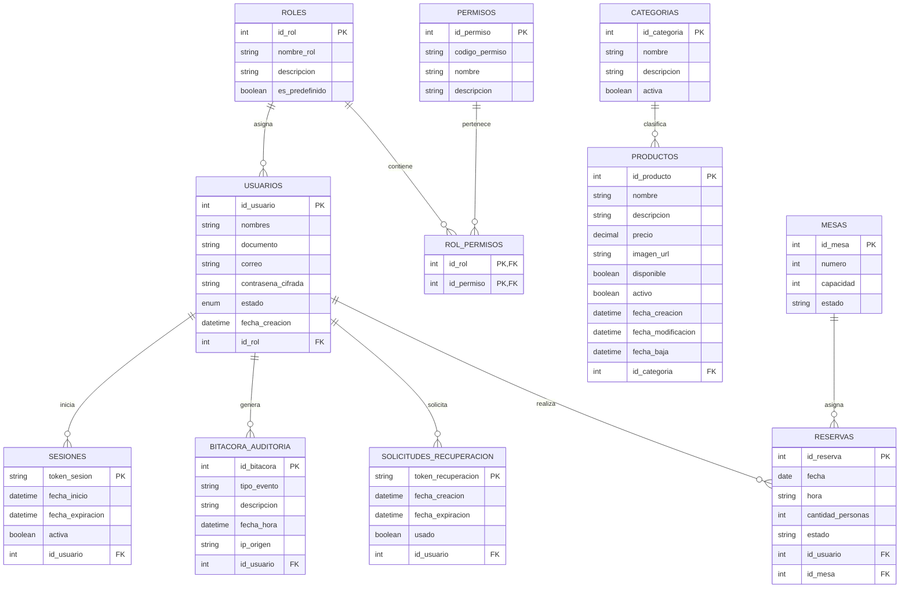

# Sistema Integral de Administración para Restaurantes (SIAR)

## Modelo Entidad-Relación (DER) - Módulos 1, 2 y 3

```mermaid
erDiagram
    %% --- MÓDULO 1: USUARIOS Y PERMISOS ---
    ROLES ||--o{ USUARIOS : asigna
    ROLES ||--o{ ROL_PERMISOS : contiene
    PERMISOS ||--o{ ROL_PERMISOS : pertenece
    USUARIOS ||--o{ SESIONES : inicia
    USUARIOS ||--o{ BITACORA_AUDITORIA : genera
    USUARIOS ||--o{ SOLICITUDES_RECUPERACION : solicita

    %% --- MÓDULO 2: MENÚ ---
    CATEGORIAS ||--o{ PRODUCTOS : clasifica

    %% --- MÓDULO 3: MESAS Y RESERVAS ---
    USUARIOS ||--o{ RESERVAS : realiza
    MESAS ||--o{ RESERVAS : asigna

    %% --- TABLAS MÓDULO 1 ---
    USUARIOS {
        int id_usuario PK
        string nombres
        string documento
        string correo
        string contrasena_cifrada
        enum estado
        datetime fecha_creacion
        int id_rol FK
    }

    ROLES {
        int id_rol PK
        string nombre_rol
        string descripcion
        boolean es_predefinido
    }

    PERMISOS {
        int id_permiso PK
        string codigo_permiso
        string nombre
        string descripcion
    }

    ROL_PERMISOS {
        int id_rol PK, FK
        int id_permiso PK, FK
    }

    SESIONES {
        string token_sesion PK
        datetime fecha_inicio
        datetime fecha_expiracion
        boolean activa
        int id_usuario FK
    }

    SOLICITUDES_RECUPERACION {
        string token_recuperacion PK
        datetime fecha_creacion
        datetime fecha_expiracion
        boolean usado
        int id_usuario FK
    }

    BITACORA_AUDITORIA {
        int id_bitacora PK
        string tipo_evento
        string descripcion
        datetime fecha_hora
        string ip_origen
        int id_usuario FK
    }

    %% --- TABLAS MÓDULO 2 ---
    CATEGORIAS {
        int id_categoria PK
        string nombre
        string descripcion
        boolean activa
    }

    PRODUCTOS {
        int id_producto PK
        string nombre
        string descripcion
        decimal precio
        string imagen_url
        boolean disponible
        boolean activo
        datetime fecha_creacion
        datetime fecha_modificacion
        datetime fecha_baja
        int id_categoria FK
    }

    %% --- TABLAS MÓDULO 3 ---
    MESAS {
        int id_mesa PK
        int numero
        int capacidad
        string estado
    }

    RESERVAS {
        int id_reserva PK
        date fecha
        string hora
        int cantidad_personas
        string estado
        int id_usuario FK
        int id_mesa FK
    }
```
