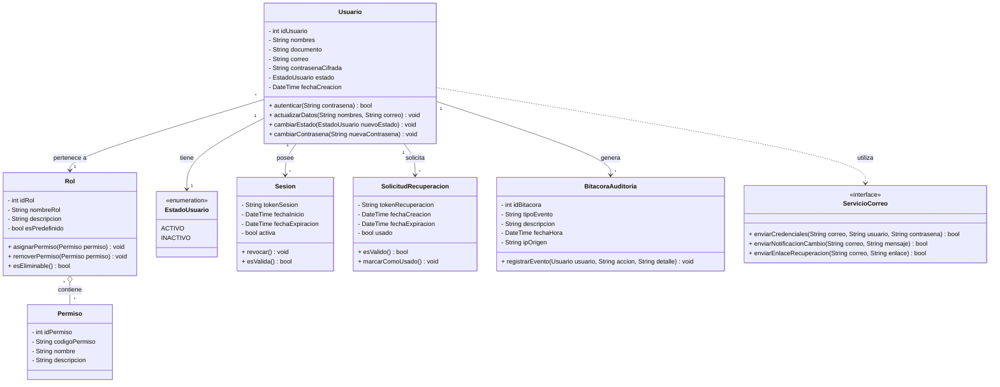

# Módulo 1: Gestión de Usuarios - SIAR

## Diagrama de Clases UML

```mermaid
classDiagram
    class Usuario {
        - int idUsuario
        - String nombres
        - String documento
        - String correo
        - String contrasenaCifrada
        - EstadoUsuario estado
        - DateTime fechaCreacion
        + autenticar(String contrasena) bool
        + actualizarDatos(String nombres, String correo) void
        + cambiarEstado(EstadoUsuario nuevoEstado) void
        + cambiarContrasena(String nuevaContrasena) void
    }

    class Rol {
        - int idRol
        - String nombreRol
        - String descripcion
        - bool esPredefinido
        + asignarPermiso(Permiso permiso) void
        + removerPermiso(Permiso permiso) void
        + esEliminable() bool
    }

    class Permiso {
        - int idPermiso
        - String codigoPermiso
        - String nombre
        - String descripcion
    }

    class EstadoUsuario {
        <<enumeration>>
        ACTIVO
        INACTIVO
    }

    class Sesion {
        - String tokenSesion
        - DateTime fechaInicio
        - DateTime fechaExpiracion
        - bool activa
        + revocar() void
        + esValida() bool
    }

    class SolicitudRecuperacion {
        - String tokenRecuperacion
        - DateTime fechaCreacion
        - DateTime fechaExpiracion
        - bool usado
        + esValido() bool
        + marcarComoUsado() void
    }

    class BitacoraAuditoria {
        - int idBitacora
        - String tipoEvento
        - String descripcion
        - DateTime fechaHora
        - String ipOrigen
        + registrarEvento(Usuario usuario, String accion, String detalle) void
    }

    class ServicioCorreo {
        <<interface>>
        + enviarCredenciales(String correo, String usuario, String contrasena) bool
        + enviarNotificacionCambio(String correo, String mensaje) bool
        + enviarEnlaceRecuperacion(String correo, String enlace) bool
    }

    %% Relaciones
    Usuario "1" --> "1" EstadoUsuario : tiene
    Usuario "*" --> "1" Rol : pertenece a
    Rol "*" o-- "*" Permiso : contiene
    Usuario "1" --> "*" Sesion : posee
    Usuario "1" --> "*" SolicitudRecuperacion : solicita
    Usuario "1" --> "*" BitacoraAuditoria : genera
    Usuario ..> ServicioCorreo : utiliza
```
